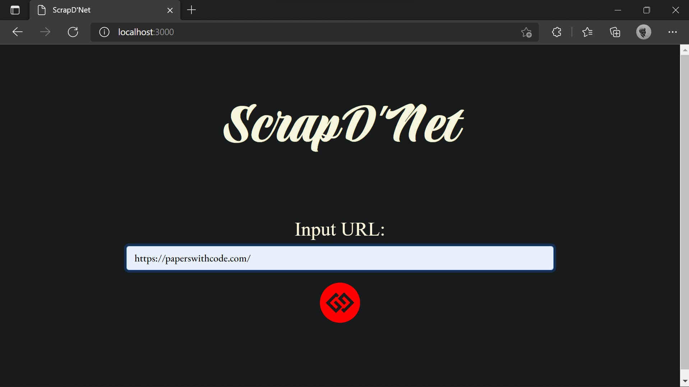
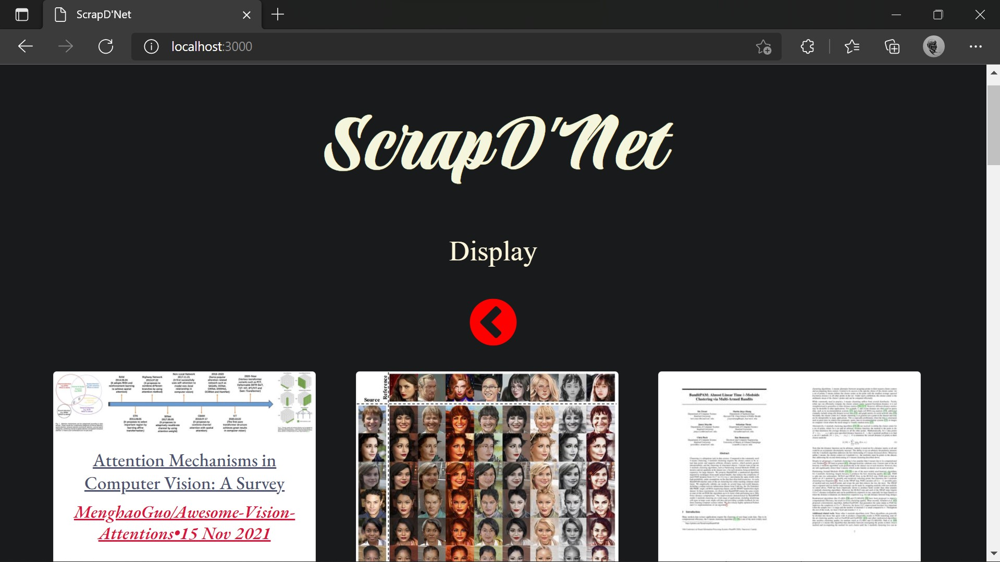
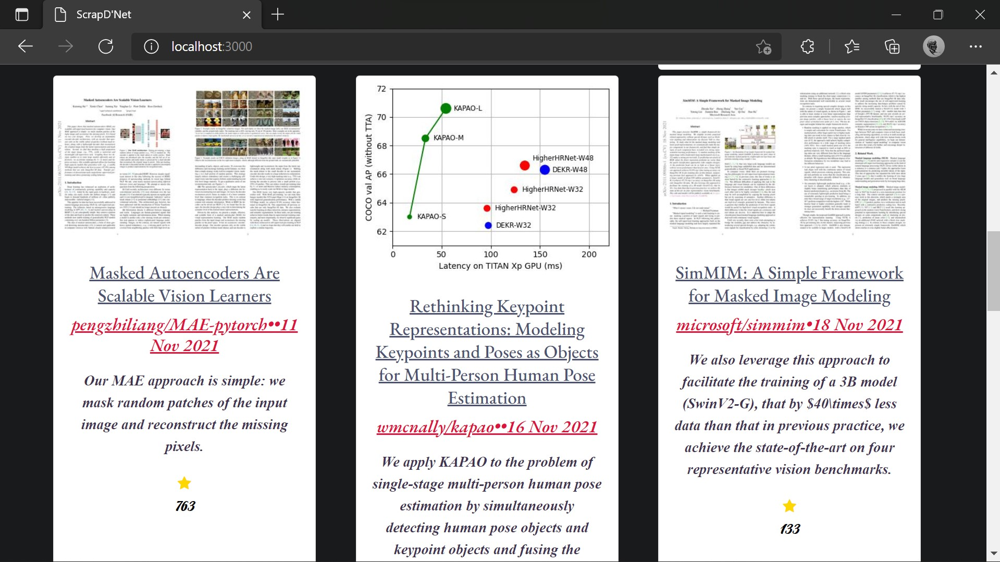

## *Welcome to Scrap D'Net!*

***(Project Developed as a Task for WEC-Rec 2021)***
### Project Details:
Scrap D'Net is a webisite which scraps off posts from the website - *www.paperswithcode.com* and displays it in the form of cards.
 
 
The website used for scraping is a famous website in the field of ML/Ai research as it updates people on current important research papers and developements in the field of ML/Ai.

### Tech used:
- *Node.js and it's basic libraries to setup a server.*
- *Cheerio.js library for web-scraping*
- *Axios for requesting data from urls.*
- *Bootstrap & CSS for designing.*

### Screenshots:
1. Main Page   

2. Scraped Page   

  

### To Run:
- clone the repo
- run `npm install`
- run index.js